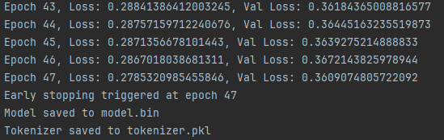
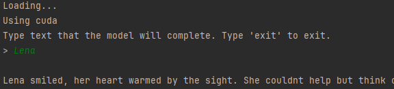

# Why Snakes (YS-LLM)


`"Why did it have to be snakes?"`

## Current Development: Why Snakes - v0.3 Base Model

I've taken a step back from following the mamba-2 paper so closely and focused on making a simple state space model work. 

## Design Philosophy and Goals:

I was originally inspired by the Mamba 2 paper. The idea of an LLM built with a non-transformer architecture excited me
because the current architectures require a tremendous amount of hardware even to produce small models that work well 
for a self-hosted solution

I'm not convinced that state space models will be the technology that replaces transformers. There are a lot of 
challenges around optimizing them, and achieving state-of-the-art quality is not easy. We've seen a couple state
space models released recently, including Mamba 2, but also Mistral's Codestral.

The hardest part of training a models in this family is numeric stability.  

My goals for the base model included:

#### State Space Model Focused:

Prioritize the sequential processing strengths of SSMs, which are more efficient on limited hardware compared to transformers.

This allows the model to efficiently handle sequences without the heavy computational load typically associated with transformer-based attention.

State space models can be highly optimized use semiseparable structured matrices, which allows you to quickly do 
parallel addition for state accumulation, but after spending weeks trying to make this work well for myself, I found it
very frustrating. I'm still learning, and I'm likely making some major mistakes, but it was non-trivial.

I went back to the roots of state space models. It effectively relies on three trainable matrices, that I think of as:
* State Controller
* Input Influencer
* Output Shaper

If you look at formal papers, they'll call them `A, B, C`, which is not at all helpful. The formula for putting this to 
use is something like `h_t=Ah_t + Bi[t]` and `output[t] = Ch_t`, which is equally illegible. 

The pseudocode for processing a simple sequence is effectively:
```
def ssm(sequence):
    output = []
    state = initial_state 
    for t in time_steps:
        next_data = sequence[t]
        state = (state_controller @ state) + (input_influencer @ next_data)
        output[t] = output_shaper @ state
    return stack(output)
```

Obviously, you gain efficiency by processing batches, and your sequence is really the shape of your embedding output, 
but the concept remains the same.

What mamba 2 did, was make the `input_influencer @ next_data` highly parallel by using a form of segsum (a way of 
adding up groups of values from a matrix) so that you could then do update the state without iterating over all the
time_steps in your python. The massive and efficient parallelization of that addition requires more GPU resources but 
also leads to faster processing. The downside is that you are adding long sequences of embedding matrices, which might 
exceed what a 32-bit float can hold -- giving you "inf" or "-inf" (infinity or negative infinity.) So, they'd chunk 
up the sequences to add up chunks to make this less likely. 

Unfortunately, I had far less success at emulating their work than they did. And, as I said before, it's likely my 
inexperience with optimizing segsum. I found that if I took the more standard approach to SSMs, and simply added a 
normalization step (`state = layernorm(state)`), that I could almost always train stably:
```
def ssm(sequence):
    output = []
    state = initial_state 
    for t in time_steps:
        next_data = sequence[t]
        state = (state_controller @ state) + (input_influencer @ next_data)
        state = layernorm(state)
        output[t] = output_shaper @ state
    return stack(output)
```

But my intuition went a step beyond this. While this would be enough to work with short sequences -- something I found 
on my very first day of experimenting with SSMs -- ensuring that the longer range model recollection worked was important.

In version 0.3, I've included two summaries of the token's state history. Effectively, as we go through the time steps, I 
I capture the regular updates for each step, but also have a second state space model to track what I called a 
"local summary" and a "global summary".

The summaries are simply following the ssm pattern, but their output is appended to the main state's state. Because 
they are updated less frequently, I'm allowing them to potentially learn and retain information about historical 
aspects of the conversation history and freeing up the main state to learn more about recent tokens. 

This means there are effectively three state space models:
* global -- updated every timestep
* local summary -- updated every 16 steps (with the current configuration)
* global summary -- updated every 64 steps (with the current configuration)

Because the attention is processing an entire sequence, it's imperative that we only consider steps behind the 
current steps -- as at inference time, we can't look into the future, but since we are processing the time steps 
in an intuitive forward directly, this is easy to ensure. (With the mamba 2 approach, they rely on masking to 
ensure they don't add in values from the future.)

I experimented with the local summary starting at the current timestamp and iterating backward up to 16 tokens, and 
doing this every time step. (You can't go back before the 0th time step, obviously.) This inverse ordering might make 
the oldest of those 16 tokens more impactful and the most recent the least impactful -- the nature of a recurrent 
approach -- and I felt like by having two approaches it would improve the overall quality of my results. Unfortunately,
swimming against time meant a complexity of N-squared within the cpu code, and it was dreadfully slow. If it was the 
ideal approach, we'll never know. I switched local to be an less-frequently updated summary, because it might achieve 
similar, though the burden of local knowledge would actually be on the main loop and the summary would help with history.

### Looking Ahead

The base model aims to fully leverage the advantages of SSMs while avoiding the pitfalls of traditional transformer-based approaches. By focusing on structured processing and memory-efficient techniques, the model is designed to perform well on limited hardware without compromising on capability.

## Dependencies

The all versions of the model will train on cpu, but is a little slow. My suggestion if you only have a CPU is to limit the vocabulary and sequence length.

For training and inference, I tried to keep the dependencies very minimal (just torch) -- but for building training data, I used pyyaml and ollama. 

If you have cuda (look here for exact command: https://pytorch.org/get-started/locally/):

```
pip install torch torchvision torchaudio --index-url https://download.pytorch.org/whl/cu121
```

If you don't have cuda:

```
pip install torch torchvision torchaudio
```

## Synthetic Data

Except for a few fully programmatically-generated files, I used ollama with llama 3.1 to generate training data. And I provided it as an example, but if 
you were to use this code, I'd highly encourage you to build the data that works for you.

You can generate additional data using the command:

```
pip install ollama
pip install pyyaml

python data_generator_<generator>.py
```

NOTE: I did very minimal curation on the data after generation. I relied mostly on some search and replaces and the
grammar checker built into PyCharm. I didn't scan for offensive material or inaccuracies and entirely relied on the
Llama 3.1's guardrails to not be offensive. I curated the list of english words, wiki topics, and dates, but I'm sure
that I missed important items. I'm human and had limited time. I used a popular chatbot to get lists and then manually
filtered them down, but there were a few thousand things to look at. I generally avoided politics and religion, but it
would not shock me if some crept in. I also attempted to balance identity and heritage, but I'm sure that my own
background impacted that. I'm simply not aware of all cultures, identities, and backgrounds, and I'm not really
qualified to balance that data perfectly.

Words that I frequently searched for:
* `note:` (llama 3.1 likes to add notes that don't belong in the content back to user within the content.)
* `**note**`
* `cannot` (llama 3.1 will refuse to generate some content -- usually 'horror', 'political event', 'fear', 'shame', 'greed', or 'disgust')
* `can't write`
* `can't help`
* `can't generate`
* `I'm an AI`
* `references:` (llama 3.1 will create links to things that don't seem to exist.)
* `**references**`
* `sources`
* `**sources**`
* `links`
* `citation`
* `real` (llama 3.1 will sometimes refuse to write about an event if it thinks it is real -- which might be funny because this is all synthetic data, but these are usually political scenes, which makes it much more sad to me. The search for 'cannot' may be enough.)
* `http://`
* `https://`
* `www.`

Regex patterns: 
* `\[.*\]`  (generated MD links)

## Bias, Safety, and guardrails

Because this is a base model, there aren't any guardrails at all. It just completes based on what it is trained on. My 
example model uses llama 3.1 to generate data, but one of the challenges there is that there is sometimes complete 
garbage responses. They are wrong or inappropriate. 

What's more llama 3.1's own guardrails prevent it from writing some responses... like reviews for disgusting movies or 
about a political event. The issue with that our sentiment analysis doesn't understand some emotions like disgust as 
well, because it hasn't seen as much of that emotion.

I feel like your base model should be fairly raw, even if that means it writes inappropriate things, because that will 
help it be more successful later when you add guardrails during fine-tuning. It will identify prompts it shouldn't respond to or ways it 
shouldn't respond.

## Train

Depending on how much GPU you have or whether you are using a CPU, you might want to tweak the training sequence length
to fit your hardware. Also, you might simply not want to wait for the time it takes to train a 768 token training
sequence length. Training sequence length is how many tokens are used to train at a time. Fewer means you aren't
teaching it to understand longer text. There's no set context length at runtime, but your training sequence length will
impact the runtime performance.

I documented the memory I *observed* being used for a number of settings. Without any model running, I'll often see
around 0.6 GB of GPU used. Your vocabulary size will impact this, if you change the tokenizer. I didn't make an effort
to be ultimately efficient. Your milage may vary if you have a smaller or larger vocabulary.

With v0.1, I tested a lot with a training sequence length of 20, and it worked surprisingly well. It runs well even if you have a
CPU.

If you are looking to quickly try out the v0.1 model without needing it to do much, I'd suggest a batch size of 64, a
training sequence length of 20, and using a limited number of documents to keep your vocab down.

Training sequence length and batch size can be changed at the bottom of `train.py`. Vocabulary size depends directly on
the documents in `.\training_data\`.

REUSE YOUR TOKENIZER if you stop and restart training. The order files are processed to train the tokenizer will impact
token indices, and you'll effectively be restarting training from worse than scratch if you don't reuse the tokenizer
you started with. The training code will do this, but only if you don't delete the tokenizer.pkl file.

Train the model with the command:

```
python train.py
```

To remove existing model files before you train (so you don't resume training from an existing point):
```
python train.py clean
```

To remove existing model files and the tokenizer before you train (so you can retrain the tokenizer):
```
python train.py clean all
```

NOTE: This example shows a case where I over-fit, but I needed to ensure training worked. If I was using a much
larger training set, I would tweak my early stopping values. Overfitting means that the results are coherent, but that
the model isn't versatile. It's effectively memorizing the training data.

Example training:



## Run

Run the model with the command:

```
python run.py
```

This enters a cli mode where you give text, and it completes the text. Nothing fancy.

Example usage:



## Where is the Positional Embedding?

When you look at the simplicity of the model, your first reaction might be, "Erik forgot the positional embeddings!
Where is RoPE?"

It turns out that SSMs naturally keep some amount of positional information, so you don't need to do specific positional
embeddings!

Maybe our understanding will change in the future, or maybe there's a different way to improve performance, but I found
that I really didn't need them. 

The paper specifically calls out using positional embedding to allow concurrent operations efficiently, but in my 
experiments, the results only were worse. It's entirely possible that I made a mistake.

## Related Details

Mamba 2 paper: https://arxiv.org/pdf/2405.21060

HiPPO initialization paper: https://arxiv.org/pdf/2206.12037

Blog on Mamba 2:

* https://tridao.me/blog/2024/mamba2-part1-model/
* https://tridao.me/blog/2024/mamba2-part2-theory/
* https://tridao.me/blog/2024/mamba2-part3-algorithm/
* https://tridao.me/blog/2024/mamba2-part4-systems/

## Previous Releases: 

### Why Snakes - v0.1 Base Model

The "Why Snakes" v0.1 base model is an example Large Language Model (LLM) that leverages State Space Model (SSM) concepts from the Mamba 2 paper for its attention mechanism. You can find it on the release page of the GitHub page. It has 120 million parameters.

#### v0.1 Training Observations and Speculation

* Memory Used: I looked at how much GPU was being used at during training and wrote it down.
    * When making changes to the model design, I knew it would impact the memory usage, so I put ? when I was no longer
      confident in the number.
* Training Sequence Length: size of chunks of text that are used to train on.
    * This is analogous to context size, but it won't limit context size during inference. During inference, your context
      length is limited by your available memory.
    * Despite an infinite context length, if you use a short training sequence length, then the model doesn't learn 
      how to reliably write longer responses. I don't know what is the optimally long training sequence to 
      work in most situations, but for v0.1, I opted for 3x the attention block size (96.) My rationale was 
      that it would at least teach it how to transfer knowledge between block sa little and that fit within 
      the memory that I had available. 
* Batch Size: A larger batch size (64) seems to really help with numerical stability of the model.
    * For my vocabulary size, if you can't get the loss down below 0.5, the model will not sound coherent. Batch Size
      may influence whether you can get there without first bumping into NaNs.
    * I found that I could use larger batch sizes and shorter training sequences to do initial training and get it down 
      to well below a loss of 1.0, then switch to a smaller batch and longer sequence length, and then repeat as needed.
    * I would pick my initial training sequence length to be equal to my attention block size, and then find the batch 
      size that fit in memory, then after training to near 0.5, switch to 2x the attention block and adjust the batch 
      size down until it fits, then 3x the attention block size... and you see the pattern.
* Attention Block Size: How many tokens are blocked together for attention.
    * The bigger the blocks, the greater understanding will go into each of those blocks, but the memory requirements
      will shoot up. Smaller blocks should do a better job of being coherent within a given sentence, but some of that
      coherence will be lost when transferring knowledge to the next block.
    * Basically, I think the bigger the block the better, but only if you have a large enough state dimension to hold
      the knowledge. My state dim is rather small, so I've started experimenting with smaller state blocks.
    * I had initially picked 50 for no good reason, and switched to 64 and then 32 and then 16. My rationale for powers
      of two is that maybe it'll help with memory alignment.
    * I suspect there's value in having a larger training sequence length than attention block size.
* Vocabulary Size: How many tokens (words, sort of) does the tokenizer know about.
    * Our tokenizer will handle any input, but since it breaks down unknown words into individual characters, it's not
      likely to use them intelligently. If it runs across a character it can't handle, it will discard it.
    * Obviously, you could use a smaller dataset for training. I feel like I'm already using a fairly small training
      set, but if you are on a CPU, and just playing around, you could just train with a single one of the example
      files. A smaller vocabulary will reduce memory requirements and training time, but give you worse end results.
* Parameters: This is total parameters (rather than trainable parameters) because it gives you a better sense of memory
  needs.
* Embedding Dimensions: I started with 256, and found 368 was better for my vocabulary. I suspect that 768 or more would
  be better, but that would use considerably more memory.
* State Space Model Dimensions: I used 368. I started with 256, but then found that 368 was better for my vocab size
* Output size: is how bit the output layer is before logits are calculated

| Memory Used | Training Sequence Length | Batch Size | Attention Block Size | Vocabulary Size | Embedding Size | SSD Size | Output Size | Parameters  |
|-------------|--------------------------|------------|----------------------|-----------------|----------------|----------|-------------|-------------|
| 19.0 GB     | 256                      | 64         | 64                   | 13,183          | 256            | 256      | 256         | 23,737,727  |
| 21.5 GB     | 512                      | 16         | 64                   | 13,183          | 256            | 256      | 256         | 23,737,727  |
| 21.5 GB     | 128                      | 64         | 64                   | 13,183          | 368            | 368      | 368         | 59,959,647  |
| 21.9 GB     | 128                      | 64         | 16                   | 28,590          | 368            | 368      | 368         | 71,314,606  |
| 21.6 GB     | 72                       | 64         | 32                   | 33,438          | 448            | 448      | 448         | 120,513,182 |
| 21.8 GB     | 96                       | 20         | 32                   | 33,438          | 448            | 448      | 448         | 120,513,182 |
| 21.6 GB     | 32                       | 1          | 32                   | 33,438          | 768            | 624      | 768         | 295,915,902 |

If you use more than 21.6, there's a risk during back propagation you'll run out of memory while loading up the data
set. I've had some lucky runs with more, but I wouldn't count on it. I speculate the difference is that my data loader
loads random files and if a small file is first, it somehow lets the rest work out. I'm fuzzy on why it doesn't fail
eventually.

I got training to start running on an L4 TPU with 296 million parameters, but with a batch size of 1, it would likely
not only be unbearably slow, I imagine that it'd eventually be numerically unstable. Any batch size less than 64 has
been problematic.

### Why Snakes - v0.2 Base Model

See release notes for v0.2. It wasn't super good, but it was more faithful to the Mamba 2 paper. I trained on an a100 with 80 gb of video memory. It has 99 million parameters.

The v0.1 model was better than v0.2.

#### v0.2 Training Observations and Speculation

* I really struggled with numeric stability. It seemed fine on my machine before beginning training with a larger 
dataset, but it became a constant battle to keep training.
* I needed a lot of memory just for batch size -- to help stabilize training, which meant the overall model 
 parameters was smaller than the first version.
* Grouped query value made things more unstable and I had to abandon it, but I'd like to consider it in the future.
* I built a custom dataset loader that uses variable sequences lengths -- each batch gets a different length, to 
 help train the model to understand longer and shorter sequences. This worked, as long as I trained the short 
 sequences first during the first epoch -- otherwise I'd bump into numerical instability again. I'm not sure if 
 doing variable sequence length was a great idea. It created a lot of complications. I think my rationale for 
 it may have been flawed.
* I put a lot of effort into ensuring that the attention block could have embedding and output dimensions that 
 didn't match the attention dimensions, and that was likely a complete waste of energy as well.
* Training on complicated patterns in the early iterations is inefficient. I think in the future, I'll get the loss to 
 converge fairly low and then do a second round of training with more complex training data.