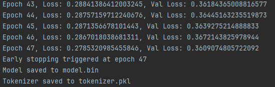
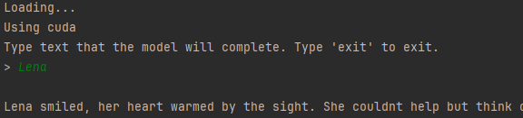

# YS-71M-v0.1


`"Why did it have to be snakes?"`

"Why Snakes" 71 Million is an example LLM that leverages ideas from the Mamba 2 paper for its attention.

This LLM is based on my understanding of Mamba 2 and works with CPU or GPU.

## Dependencies

The model will train on cpu, but is a little slow.

If you have cuda:

```
pip install torch torchvision torchaudio --index-url https://download.pytorch.org/whl/cu121
```

If you don't have cuda:

```
pip install torch torchvision torchaudio
```

## Generate Data

I used ollama with llama 3.1 to generate training data.

You can generate additional data using the command:

```
pip install ollama

python data_generator.py
```

NOTE: I did very minimal curation on the data after generation. I relied mostly on some search and replaces and the
grammar checker built into PyCharm. I didn't scan for offensive material or inaccuracies and entirely relied on the
Llama 3.1's guardrails to not be offensive. I curated the list of english words, wiki topics, and dates, but I'm sure
that I missed important items. I'm human and had limited time. I used a popular chatbot to get lists and then manually
filtered them down, but there were a few thousand things to look at. I generally avoided politics and religion, but it
would not shock me if some crept in. I also attempted to balance identity and heritage, but I'm sure that my own
background impacted that. I'm simply not aware of all cultures, identities, and backgrounds, and I'm not really
qualified to balance that data perfectly.

## Train

Depending on how much GPU you have or whether you are using a CPU, you might want to tweak the training sequence length
to fit your hardware. Also, you might simply not want to wait for the time it takes to train a 768 token training
sequence length. Training sequence length is how many tokens are used to train at a time. Fewer means you aren't
teaching it to understand longer text. There's no set context length at runtime, but your training sequence length will
impact the runtime performance.

I documented the memory I *observed* being used for a number of settings. Without any model running, I'll often see
around 0.6 GB of GPU used. Your vocabulary size will impact this, if you change the tokenizer. I didn't make an effort
to be ultimately efficient. Your milage may vary if you have a smaller or larger vocabulary.

I tested a lot with a training sequence length of 20, and it worked surprisingly well. It runs well even if you have a
CPU.

If you are looking to quickly try out the model without needing it to do much, I'd suggest a batch size of 64, a
training sequence length of 20, and using a limited number of documents to keep your vocab down.

Training sequence length and batch size can be changed at the bottom of `train.py`. Vocabulary size depends directly on
the documents in `.\training_data\`.

REUSE YOUR TOKENIZER if you stop and restart training. The order files are processed to train the tokenizer will impact
token indices, and you'll effectively be restarting training from worse than scratch if you don't reuse the tokenizer
you started with. The training code will do this, but only if you don't delete the tokenizer.pkl file.

Train the model with the command:

```
python train.py
```

NOTE: This example shows a case where I over-fit, but I needed to ensure training worked. If I was using a much
larger training set, I would tweak my early stopping values. Overfitting means that the results are coherent, but that
the
model isn't versatile. It's effectively memorizing the training data.

Example training:


### Training Observations and Speculation

* Memory Used: I looked at how much GPU was being used at during training and wrote it down.
    * When making changes to the model design, I knew it would impact the memory usage, so I put ? when I was no longer
      confident in the number.
* Training Sequence Length: size of chunks of text that are used to train on.
    * This is analogous to context size, but I don't limit context size during inference. During inference, your context
      length is limited by your available memory.
* Batch Size: A larger batch size (64) seems to really help with numerical stability of the model.
    * For my vocabulary size, if you can't get the loss down below 0.5, the model will not sound coherent. Batch Size
      may influence whether you can get there without first bumping into NaNs.
* Attention Block Size: How many tokens are blocked together for attention.
    * The bigger the blocks, the greater understanding will go into each of those blocks, but the memory requirements
      will shoot up. Smaller blocks should do a better job of being coherent within a given sentence, but some of that
      coherence will be lost when transferring knowledge to the next block.
    * Basically, I think the bigger the block the better, but only if you have a large enough state dimension to hold
      the knowledge. My state dim is rather small, so I've started experimenting with smaller state blocks.
    * I had initially picked 50 for no good reason, and switched to 64 and then 32 and then 16. My rationale for powers
      of two is that maybe it'll help with memory alignment.
    * I suspect there's value in having a larger training sequence length than attention block size.
* Vocabulary Size: How many tokens (words, sort of) does the tokenizer know about.
    * Our tokenizer will handle any input, but since it breaks down unknown words into individual characters, it's not
      likely to use them intelligently. If it runs across a character it can't handle, it will discard it. 
    * Obviously, you could use a smaller dataset for training. I feel like I'm already using a fairly small training
      set, but if you are on a CPU, and just playing around, you could just train with a single one of the example
      files. A smaller vocabulary will reduce memory requirements and training time, but give you worse end results.
* Parameters: This is total parameters (rather than trainable parameters) because it gives you a better sense of memory
  needs.
* Embedding Dimensions: I started with 256, and found 368 was better for my vocabulary. I suspect that 768 or more would
  be better, but that would use considerably more memory.
* State Space Model Dimensions: I used 368. I started with 256, but then found that 368 was better for my vocab size
* Output size: is how bit the output layer is before logits are calculated

| Memory Used | Training Sequence Length | Batch Size | Attention Block Size | Vocabulary Size | Embedding Size | SSD Size | Output Size | Parameters |
|-------------|--------------------------|------------|----------------------|-----------------|----------------|----------|-------------|------------|
| 21.5 GB     | 128                      | 64         | 64                   | 13183           | 368            | 368      | 368         | 59,959,647 |
| 21.9 GB     | 128                      | 64         | 16                   | 28590           | 368            | 368      | 368         | 71,314,606 |
| 19.0 GB     | 256                      | 64         | 64                   | 13183           | 256            | 256      | 256         | 23,737,727 |
| 21.5 GB     | 512                      | 16         | 64                   | 13183           | 256            | 256      | 256         | 23,737,727 |

## Run

Run the model with the command:

```
python run.py
```

This enters a cli mode where you give text, and it completes the text. Nothing fancy.

Example usage:


## Where is the RoPE?

When you look at the simplicity of the model, your first reaction might be, "Erik forgot the positional embeddings!
Where is RoPE?"

It turns out that SSMs naturally keep some amount of positional information, so you don't need to do specific positional
embeddings!

Maybe our understanding will change in the future, or maybe there's a different way to improve performance, but I found
that I really didn't need them.

## Related Details

Mamba 2 paper: https://arxiv.org/pdf/2405.21060

HiPPO initialization paper: https://arxiv.org/pdf/2206.12037

Blog on Mamba 2:

* https://tridao.me/blog/2024/mamba2-part1-model/
* https://tridao.me/blog/2024/mamba2-part2-theory/
* https://tridao.me/blog/2024/mamba2-part3-algorithm/
* https://tridao.me/blog/2024/mamba2-part4-systems/
